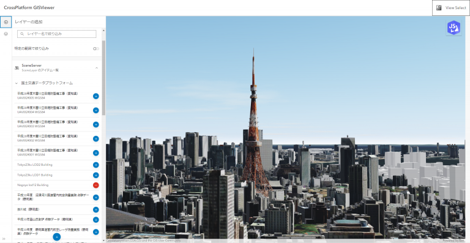

# CrossPlatform GISViewer

[アーバンデータチャレンジ2023](https://urbandata-challenge.jp/news/udc2023_final)用に作成した ArcGIS Maps SDK for JavaScript とオープンソースライブラリである CesiumJS と deck をそれぞれ同期した挙動を確認できる Web アプリケーションです。
この Web アプリケーションでは、[国土交通データプラットフォーム](https://www.mlit-data.jp/#/)から提供される主要なデータを[国土交通データプラットフォーム GIS コミュニティ利用実証ポータル](https://mdpf-mlit-data.hub.arcgis.com/)から参照して各ライブラリ上にデータの表示、非表示、削除をすることができます。また、異なる [ArcGIS Hub](https://www.esrij.com/products/arcgis-hub/) で構築された Hub コンテンツからデータを参照して、テキスト検索及び空間検索ができます。

## 機能
* 3つのライブラリが同期した表示
* [Dcat 形式](https://www.w3.org/TR/vocab-dcat-3/)を利用したデータ連携
* データの横断的なテキスト検索と空間検索

## 使用しているライブラリ
* [ArcGIS Maps SDK for JavaScript](https://developers.arcgis.com/javascript/latest/) バージョン 4.29
* [ArcGIS REST JS](https://developers.arcgis.com/arcgis-rest-js/) 
* [CesiumJS](https://cesium.com/platform/cesiumjs/) バージョン 1.115
* [deck.gl](https://deck.gl) バージョン 8.9
* [loaders.gl](https://loaders.gl) バージョン 3.4.15
* [MapLibre GL JS](https://maplibre.org/maplibre-gl-js/docs/) バージョン 4.1.1

ArcGIS の開発キットを使用して開発を行う場合は [ArcGIS Developers](https://developers.arcgis.com/) 開発者アカウントが必要です。開発者アカウントは無償で作成することができます。作成方法は[こちら](https://esrijapan.github.io/arcgis-dev-resources/get-dev-account/)を参照してください。

## ライセンス
Copyright 2024 Esri Japan Corporation.

Apache License Version 2.0（「本ライセンス」）に基づいてライセンスされます。あなたがこのファイルを使用するためには、本ライセンスに従わなければなりません。本ライセンスのコピーは下記の場所から入手できます。

> http://www.apache.org/licenses/LICENSE-2.0
